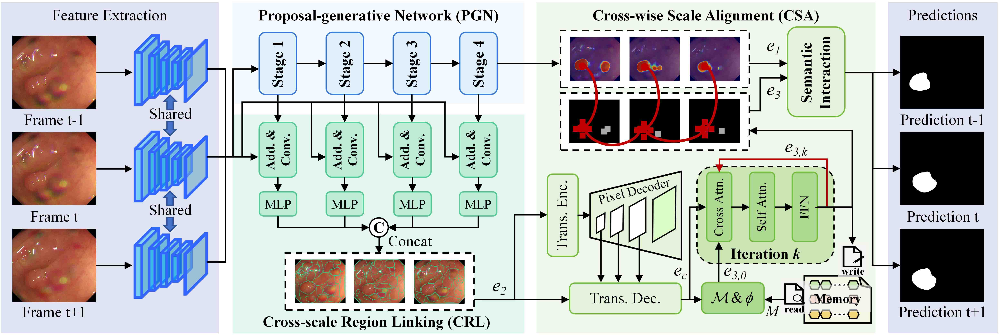

#  _An Embedding-Unleashing Video Polyp Segmentation Framework via Region Linking and Scale Alignment_
<!-- Official implementation of AAAI-24 paper: An Embedding-Unleashing Video Polyp Segmentation Framework via Region Linking and Scale Alignment. -->
### [Paper]()
> [**An Embedding-Unleashing Video Polyp Segmentation Framework via Region Linking and Scale Alignment**]()         
> [Zhixue Fang](), [Xinrong Guo](), [Jingyin Lin](), [Huisi Wu](), and [Jing Qin]() \
> **AAAI 2024**



## Installation
See [installation instructions](INSTALL.md). Please try to follow the instructions to install. The process seems a little complex (🤡🤡🤡). 

## Dataset Preparation
You can request SUN-SEG dataset [here](https://github.com/GewelsJI/VPS.git), and CVC-612 dataset [here](https://polyp.grand-challenge.org/CVCClinicDB/).
Please make sure the data folder looks like this:
```
DATA_VPS
|── SUN-SEG
│   ├── TrainDataset
│   │   ├── Frame
│   │   │   ├── case15_1
│   │   │   |   ├── case_M_20190131094104_0U62367013193703_1_003_001-1_a7_ayy_image0001.jpg
│   │   │   |   ├── case_M_20190131094104_0U62367013193703_1_003_001-1_a7_ayy_image0002.jpg
│   │   │   |   ├── ...
│   │   │   ├── ...
│   │   ├── GT
│   │   │   ├── case15_1
│   │   │   |   ├── case_M_20190131094104_0U62367013193703_1_003_001-1_a7_ayy_image0001.png
│   │   │   |   ├── case_M_20190131094104_0U62367013193703_1_003_001-1_a7_ayy_image0002.png
│   │   │   |   ├── ...
│   │   │   ├── ...
│   ├── ValDataset
│   ├── TestDataset
|── CVC-612
│   ├── PNG
│   │   ├── Frame
│   │   │   ├── train
│   │   │   |   ├── 1.png
│   │   │   |   ├── ...
│   │   │   ├── val
│   │   │   ├── test
│   │   ├── GT
│   │   │   ├── train
│   │   │   |   ├── 1.png
│   │   │   |   ├── ...
│   │   │   ├── val
│   │   │   ├── test
```

## Getting Start
Let's go for running code.🏃‍♀️🏃‍♀️🏃‍♀️

### Train
```commandline
python train_euvps.py --config-file ./configs/euvps/SUN-SEG/Base_euvps_res2net50_vps.yaml
```

### Test
```commandline
python test_euvps.py --config-file ./configs/euvps/SUN-SEG/Base_euvps_res2net50_vps.yaml
```

## Reference
```bibtex
@inproceedings{fang2024euvps,
  title={An Embedding-Unleashing Video Polyp Segmentation Framework via Region Linking and Scale Alignment},
  author={Zhixue Fang, Xinrong Guo, Jingyin Lin, Huisi Wu, and Jing Qin},
  booktitle={Proceedings of the AAAI Conference on Artificial Intelligence},
  year={2024}
}
```

